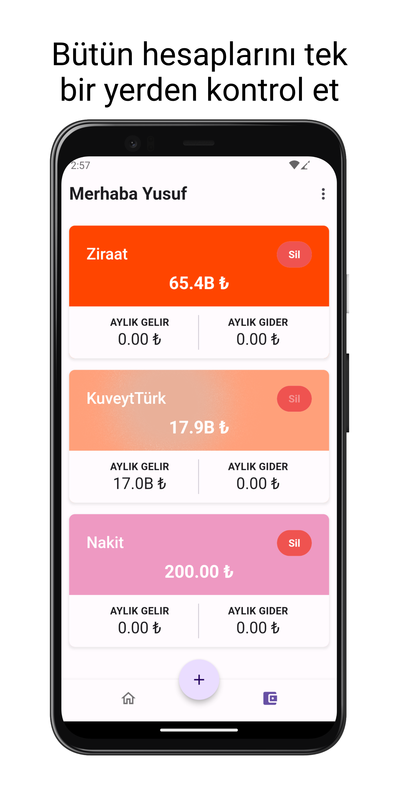
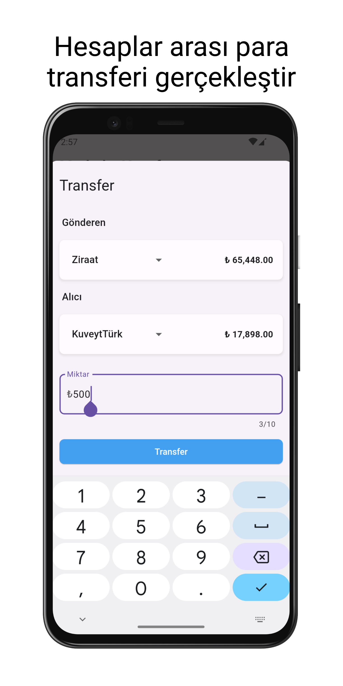

# Maliyem

+ Maliyem, kişisel ve işletme finans yönetimi için tasarlanmış kullanıcı dostu bir gelir gider takibi uygulamasıdır. Mali durumunuzu kontrol altında tutmak, harcamalarınızı izlemek ve gelirinizi artırmak için güçlü araçlar sunuyoruz.

## Temel Özellikler:

+ Basit arayüzümüzle, gelirinizi ve giderlerinizi kolayca takip edin.
+ Harcamalarınızı detaylı raporlarla izleyin ve finansal alışkanlıklarınızı anlayın.
+ Tasarruf etmek veya borçları ödemek için hedefler belirleyin ve ilerlemenizi takip edin.
+ Verileriniz güvenli bir şekilde depolanır ve gizliliğiniz her zaman korunur.

## Kurulum:

    git clone https://github.com/cusufcan/maliyem

## Ekran Görüntüleri:

<table>
    <tr>
        <td></td>
        <td></td>
        <td></td>
    </tr>
    <tr>
        <td></td>
        <td></td>
        <td></td>
      </tr>
</table>

## Kullanılan Teknolojiler:

+ Flutter & Dart
+ Scroll Date Picker
+ Shared Preferences
+ Flutter Native Splash
+ Provider
+ Pie Chart

## Lisans:

    MIT

