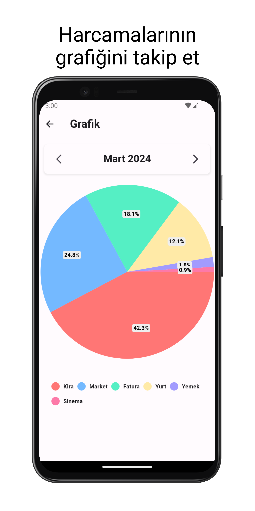

# Maliyem

Maliyem, kişisel ve işletme finans yönetimi için tasarlanmış kullanıcı dostu bir gelir gider takibi uygulamasıdır. Mali durumunuzu kontrol altında tutmak, harcamalarınızı izlemek ve gelirinizi artırmak için güçlü araçlar sunuyoruz.

### Maliyem'in sunduğu özellikler:

- <b>Kolay Kullanım:</b> Basit arayüzümüzle, gelirinizi ve giderlerinizi kolayca takip edin.
- <b>Kapsamlı Analizler:</b> Harcamalarınızı detaylı raporlarla izleyin ve finansal alışkanlıklarınızı anlayın.
- <b>Hedef Belirleme:</b> Tasarruf etmek veya borçları ödemek için hedefler belirleyin ve ilerlemenizi takip edin.
- <b>Güvenlik:</b> Verileriniz güvenli bir şekilde depolanır ve gizliliğiniz her zaman korunur.

### Maliyem ile mali yönetiminizi kolaylaştırın ve maddi hedeflerinize ulaşmak için adım atın. Şimdi indirin ve finansal özgürlüğün tadını çıkarın!

<table>
  <tr>
    <td></td>
    <td></td>
    <td></td>
  </tr>
  <tr>
    <td></td>
    <td></td>
    <td></td>
  </tr>
</table>
